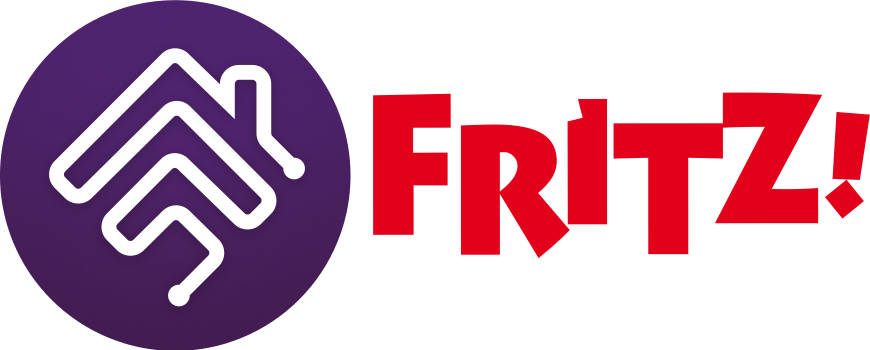
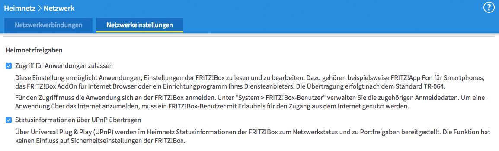
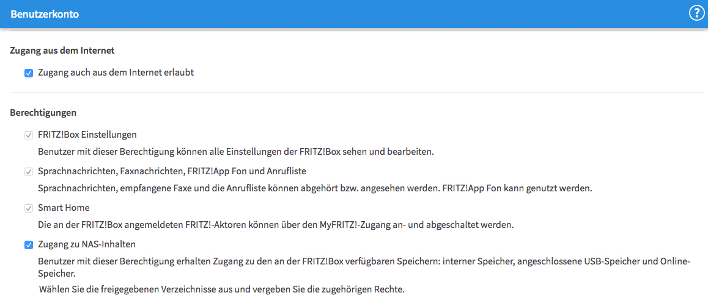

<p align="center">
  
</p>

# homebridge-fritz-light

[](https://github.com/fox34/homebridge-fritz-light)
[](https://paypal.me/stefanovanmansiere)

---

## Motivation

Development of the popular [`homebridge-fritz-platform`](https://github.com/seydx/homebridge-fritz-platform) has stalled.  
The main goal of this project is to **maintain compatibility** with modern Homebridge and FRITZ!Box firmware versions, allowing users to control key smart home functions from within HomeKit.

This plugin currently focuses on **stability and simplicity** rather than feature completeness. It provides the essential functionality needed for daily use, but it is **currently no full replacement** for the original plugin or a competitor to more comprehensive solutions such as Home Assistant integrations.

---

## Scope

Currently, this plugin supports the following devices and actions within the **FRITZ!** ecosystem:

| Device                                     | Supported actions                                                                               |
|--------------------------------------------|-------------------------------------------------------------------------------------------------|
| **Thermostats**<br>(e.g. FRITZ!DECT 301)   | - Temperature reporting<br>- Change target temperature<br>- Recall templates  |
| **Outlets**<br>(e.g. FRITZ!DECT 200 / 210) | - Power toggle<br>- Temperature reporting                                                    |

> Other FRITZ! SmartHome devices (e.g. window sensors or lights) are not yet supported.  
> Contributions are welcome if you wish to extend functionality.
> See below for further information.

---

## Configuration

You need access to a FRITZ!Box on your local network.

### 1. Enable Application Access

In your FRITZ!Box settings, enable access for local applications:  
[FRITZ! manual: Allowing Access to the Home Network for Apps and Applications](https://fritzhelp.avm.de/help/en/FRITZ-Box-4050/avm/024p1/hilfe_netzwerk_freigabe_apps)

- ✅ Allow access for applications
- ✅ Transmit status information via UPnP



### 2. Create a Dedicated User

Create a FRITZ!Box user account with full permissions for home network access:  
[FRITZ! manual: Configuring FRITZ!Box Users](https://fritzhelp.avm.de/help/en/FRITZ-Box-4050/avm/024p1/hilfe_system_userkonto)



### 3. Configure in Homebridge

You can add this plugin either via the Homebridge UI or by editing your `config.json` manually.

Example configuration:

```json
{
  "platforms": [
    {
      "name": "FRITZ! Light",
      "host": "fritz.box",
      "username": "homebridge",
      "password": "_example_password_change_me_",
      "exposeTemplates": true,
      "templatePrefix": "Template:",
      "platform": "FritzLight"
    }
  ]
}
```

---

## Technical Background

This plugin communicates directly with the FRITZ!Box using official local interfaces:

- **[TR-064 protocol](https://fritz.support/resources/TR-064_First_Steps.pdf)**: Currently only used to authenticate with the FRITZ!Box.
- **[AVM Home Automation (AHA) HTTP Interface](https://fritz.support/resources/AHA-HTTP-Interface.pdf)**: Provides access to smart home device lists and features such as thermostats, power outlets, and sensors.
- The newly developed [FRITZ! Smart Home REST API](https://fritz.support/resources/SmarthomeRestApiFRITZOS82.html) is currently not used, since it is not very broadly supported yet (e.g. not by my devices).

All communication happens **locally** within your home network; no data is transmitted to external servers.

---

## Limitations and Future Development

This plugin currently supports only thermostats and a template recall functionality.
As I no longer own other FRITZ! SmartHome devices, I am **not planning further feature development**.

However, contributions are very welcome!
If you wish to extend support for additional FRITZ! devices (e.g., plugs, switches, sensors), please fork the repository and open a pull request.

Some examples of possible devices and features are:

| Device                                    | Supported actions                                                                            |
|-------------------------------------------|----------------------------------------------------------------------------------------------|
| **FRITZ!Box**, FRITZ!Repeater             | - Toggle guest WLAN                                                                          |
| **Buttons**<br>(e.g. FRITZ!DECT 400, 440) | - Temperature and humidity reporting<br>- *Note*: Button presses cannot be detected reliably |
| **Lights**<br>(e.g. FRITZ!DECT 500)       | - Power toggle<br>- Change brightness / color<br>- Support for adaptive lighting             |
| **Sensors**<br>(e.g. FRITZ!DECT 350)      | - Window state reporting                                                                     |

---

## Credits

- Original [`homebridge-fritz-platform`](https://github.com/seydx/homebridge-fritz-platform) by [SeydX](https://github.com/seydx).
- FRITZ!Box communication is based loosely on the [`fritzbox`](https://github.com/lukesthl/fritzbox) TypeScript library by **lukesthl**.

All product and company names are trademarks™ or registered® trademarks of their respective holders.  
Use of them does not imply any affiliation with or endorsement by them.
